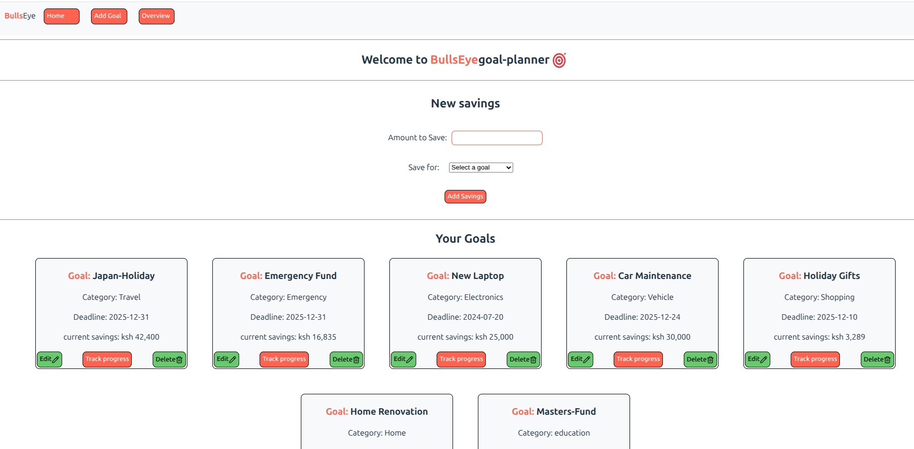
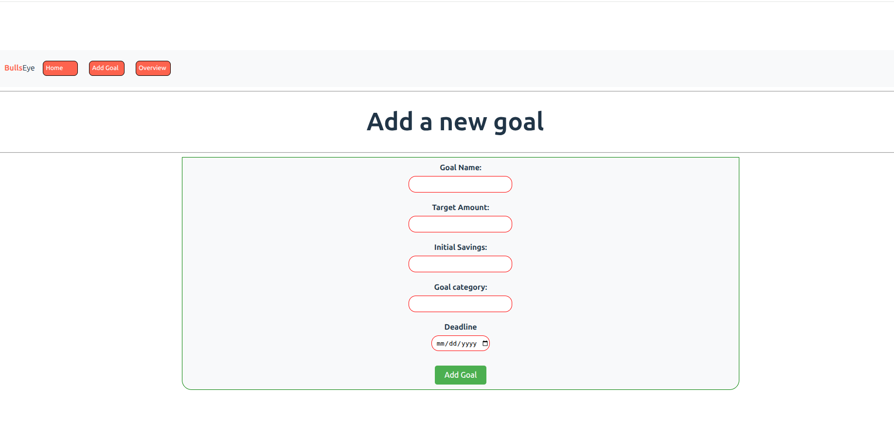
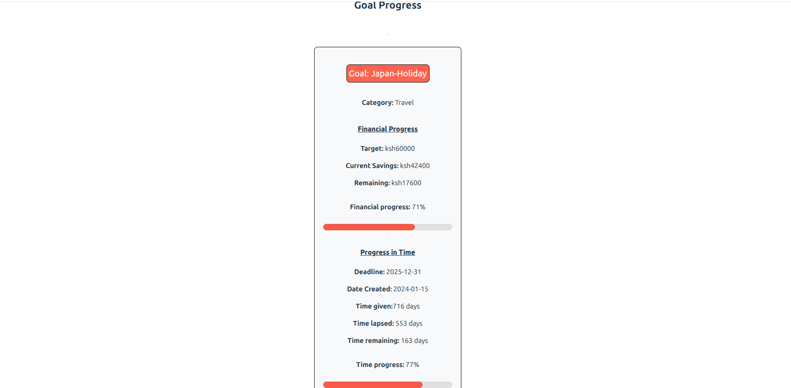
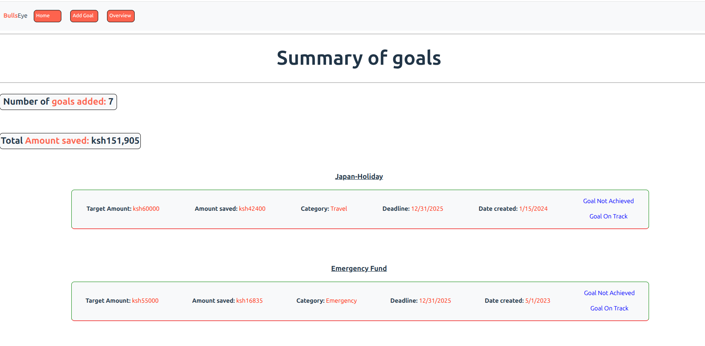

# BullsEye-goal planner
A simple and convenient way to manage and keep track of your financial goals

By Dennis Karanja
## Description
BullsEye is a simple and convenient financial goal planner suitable for individuals and small sized businesses. A user is able to view all their goals in a list, add a new goal to that list, edit the goal particulars and delete a goal or track the completion progress of a goal.
## Screenshots
### Homepage

### Add New goal

### Track progress

### Overview 

## Features
### 1. Homepage
Allows user to view all their goals in a snap and to be able to add a new saving,delete agoal, edit or track it. The savings form allows you to add savings to your goal of choice. The edit button once clicked directs you to a gaol edit window that allows user to change goal particulars as desired. To track the financial and time progress of a goal, click the tracck progress button.
### 2. New goal page
The new goal form allows you to create a new goal by inputing the goal particulars. Each input field is required. 
### 3. Overview page
The overview page allows a user to see all added goals in a summarized format. If a goal is completed, a message appears in green showing "Goal 100% complete!" If a goal's deadline is passed, a message is seen in purple indication "Goal overdue". If there are less than thirty days to a deadline, a warning appears in yellow indicating the same.
## How to use
### Requirements
To use this application, you will need a computer, tablet or phone and access to internet
### View Live site
You may access the live site of this application 
[here](https://bullseye-planner.netlify.app/)
### Installation process
1. Clone this repository using 

       git clone git@github.com:Denniskaranja2023/BullsEye-goal-planner.git
2. Navigate your terminal into the app repository

       cd BullsEye-goal-planner
3. Open the app repo in your code editor

       code .
       
4. Install all required npm packages

       npm install
5. Start your json-server
     
       npm run server
6. Open a new terminal and start the react app

       npm run dev
## Technologies Used
- REACT JavaScript
- HTML & CSS
## Support and Contact details
For any questions, clarifications or suggestions, reach out by email through denniswanyeki2021@gmail.com
## License
### MIT License
MIT License

Copyright (c) 2025 Denniskaranja2023

Permission is hereby granted, free of charge, to any person obtaining a copy
of this software and associated documentation files (the "Software"), to deal
in the Software without restriction, including without limitation the rights
to use, copy, modify, merge, publish, distribute, sublicense, and/or sell
copies of the Software, and to permit persons to whom the Software is
furnished to do so, subject to the following conditions:

The above copyright notice and this permission notice shall be included in all
copies or substantial portions of the Software.

THE SOFTWARE IS PROVIDED "AS IS", WITHOUT WARRANTY OF ANY KIND, EXPRESS OR
IMPLIED, INCLUDING BUT NOT LIMITED TO THE WARRANTIES OF MERCHANTABILITY,
FITNESS FOR A PARTICULAR PURPOSE AND NONINFRINGEMENT. IN NO EVENT SHALL THE
AUTHORS OR COPYRIGHT HOLDERS BE LIABLE FOR ANY CLAIM, DAMAGES OR OTHER
LIABILITY, WHETHER IN AN ACTION OF CONTRACT, TORT OR OTHERWISE, ARISING FROM,
OUT OF OR IN CONNECTION WITH THE SOFTWARE OR THE USE OR OTHER DEALINGS IN THE
SOFTWARE.

  
